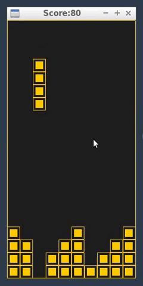

# CPPND: Capstone Tetris

This is the repo contains code for the Tetris Game made as a part of the Capstone project in the [Udacity C++ Nanodegree Program](https://www.udacity.com/course/c-plus-plus-nanodegree--nd213).

## Dependencies for Running Locally
* cmake >= 3.7
  * All OSes: [click here for installation instructions](https://cmake.org/install/)
* make >= 4.1 (Linux, Mac), 3.81 (Windows)
  * Linux: make is installed by default on most Linux distros
  * Mac: [install Xcode command line tools to get make](https://developer.apple.com/xcode/features/)
  * Windows: [Click here for installation instructions](http://gnuwin32.sourceforge.net/packages/make.htm)
* gcc/g++ >= 5.4
  * Linux: gcc / g++ is installed by default on most Linux distros
  * Mac: same deal as make - [install Xcode command line tools](https://developer.apple.com/xcode/features/)
  * Windows: recommend using [MinGW](http://www.mingw.org/)

## Basic Build Instructions

1. Clone this repo.
2. Make a build directory in the top level directory: `mkdir build && cd build`
3. Compile: `cmake .. && make`
4. Run it: `./Tetris`.

## How to Play

1. Use the arrow keys on the keyboard as follows:
    a. Left-Button : Moves the figure left by 1 unit
    b. Right-Button: Moves the figure right by 1 unit
    c. Up-Button   : Rotates the figure once by 90 degrees
    d. Down-Button : Drags the piece down faster
    e. Spacebar    : Pause/Unpause the game.
2. Score is shown in the title bar. In paused state, the title bar shows "Game Paused"

## File structure

1. TetrisGame.h/.cpp: These files define the class TetrisGame and its associated members. In a way this is the main class that houses the run loop of the game.
TetrisGame has been designed as a Singleton class. This file emulates the model of the game and relies on the Controller and Renderer as and when needed. Care has been taken that the code here is agnostic of the library used for controlling and rendering. In future, we can easily adopt a new graphics library without changing any code in these files.

2. FigureFactory.h/.cpp: These files contain code responsible for generating the figures randomly. It follows the Factory Design pattern. The class creates the figure on the heap and wraps it in a std::unique_ptr. The factory is created and maintained by the object of TetrisGame. FigureFactory::GetNextFigure() is called by the TetrisGame whenever a new figure is needed. The factory after creating the object transfers its ownership to the TetrisGame.

3. SDLRenderer.h/.cpp: These files contain code responsible for rendering the game elements like the Tetris Canvas and the figures on the screen using the SDL library.

4. SDLController.h/.cpp: These files contain code responsible for receiving inputs for the game using the SDL library. It polls the input queue and calls appropriate callbacks on TetrisGame via ITetrisControllerHost interface. This interface is implemented by the TetrisGame.

5. Figure.h/.cpp: These files define the properties and associated functionalities of a "Figure". It defines functionalities like MoveLeft, MoveRight, MoveDown, Rotate, etc. 

6. IController.h: Declares an interface (via pure virtual functions) that a platform or library specific Controller for TetrisGame is expected to implement. In our implementation, SDLController implements this interface. It also abstracts out the implementation details of the Controller from the TetrisGame making the system more modular.

7. IRenderer.h: Declares an interface (via pure virtual functions) that a platform or library specific Renderer for TetrisGame is expected to implement. In our implementation, SDLRenderer implements this interface. It also abstracts out the implementation details of the Renderer from the TetrisGame making the system more modular.

8. ITetrisHost.h: Declares an interface (via pure virtual functions) that the TetrisGame class implements. Its main purpose is to abstract the functionality of the TetrisGame class from the BaseFigure class. An object of BaseFigure needs to validate position of a figure with the TetrisGame.

9. main.cpp: Contains the main function which is the entry point of the TetrisGame. We create an instance of TetrisGame and call Run() on it to start the game.

## Rubric Points addressed:

README:
1. A README with instructions is included with the project.
2. The README indicates which project has been chosen.

Compiling & Testing:
1. The submission compiles and runs.

Loops, Functions, I/O
1. The project demonstrates an understanding of C++ functions and control structures.
2. The project accepts user input and processes the input.

Object Oriented Programming:
1. The project uses Object Oriented Programming techniques.
2. Classes use appropriate access specifiers for class members.
3. Class constructors utilize member initialization lists.
4. Classes abstract implementation details from their interfaces.
5. Classes encapsulate behavior.
6. Classes follow an appropriate inheritance hierarchy.
7. Derived class functions override virtual base class functions.

Memory Management:
1. The project makes use of references in function declarations.
2. The project uses destructors appropriately.
3. The project uses scope / Resource Acquisition Is Initialization (RAII) where appropriate.
4. The project follows the Rule of 5.
5. The project uses smart pointers instead of raw pointers.
